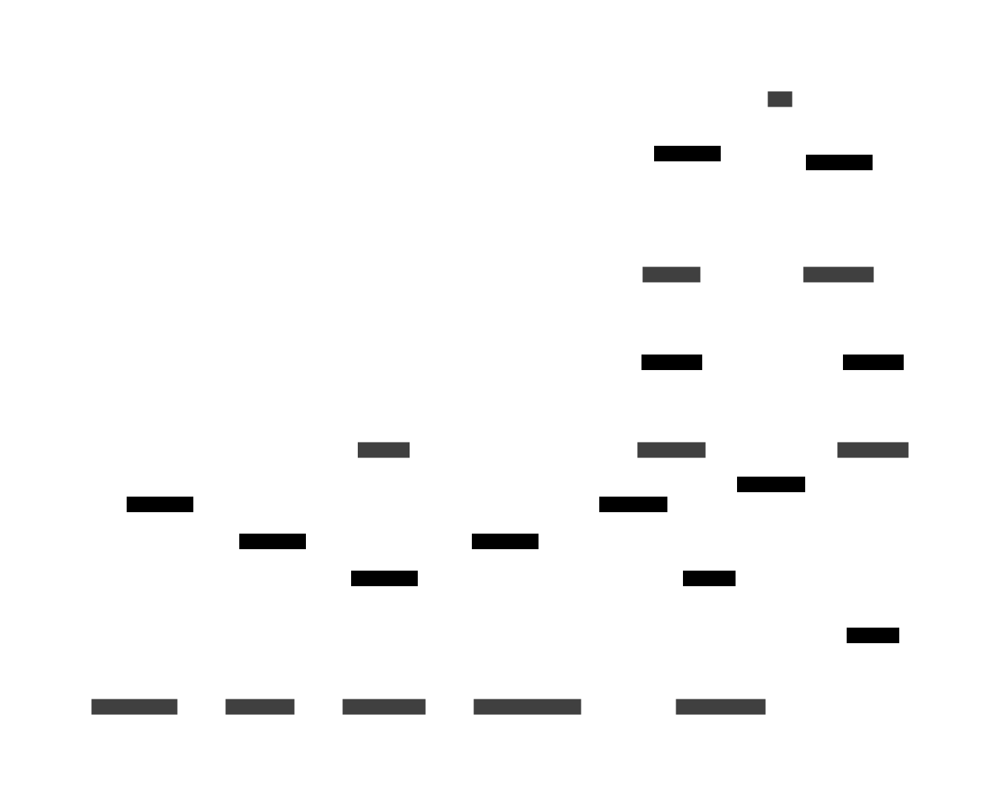

# [Accretion](https://github.com/dbtedman/accretion) Design Guide

## Principals

- Secure
- Verifiable
- Open
- Private
- Accessible
- Immutable
- Elegant
- Standards

## Commands

Represents a request for a change to be made to the state of the system, e.g. `Add Product`.

## Queries

Read only interaction with the system used to inspect its current state, e.g. `List Products`.

## Events

The systems source of truth is an immutable stream of idempotent Events which represent changes that occur to the
system, e.g. `Product Added`.

> 💡 Sensitive data will be encrypted at rest, using a secret key associated with the owner of the data, which can be
> purged on request,
>
see [GDPR Compliant Event Sourcing With HashiCorp Vault (hashicorp.com)](https://www.hashicorp.com/resources/gdpr-compliant-event-sourcing-with-hashicorp-vault)
> for reference.

## Projections

Queries won't be performed on the event log, but rather on projections derived from this log, e.g. `Search Index`.

## Data Flow

A harvester populates data into the append only event log from each of the configured external services.



```shell
d2 -w -t 200 --layout=elk ./doc/data-flow.d2 ./doc/data-flow.svg
```

## Infra

A single go binary with embedded web application supporting multiple replicas for redundancy and horizontal scalability.
